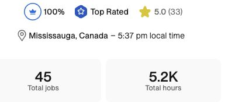
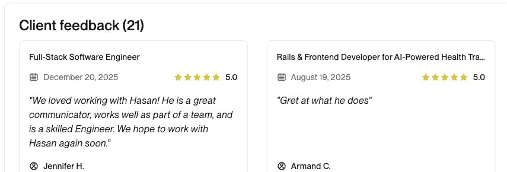

# Hasan - AI-Native Software Engineer

I design and ship AI products, agentic systems, and reliable full-stack software for founders, CTOs, and engineering teams.

For 8+ years, I have built and modernized products across backend systems, frontend experiences, automation, and delivery infrastructure. Today, I combine strong engineering fundamentals with AI-native workflows to increase throughput, shorten feedback loops, reduce avoidable errors, and launch faster without compromising quality or judgment.

## Proven Delivery

  

  

## What I Build

- **AI agents and LLM systems:** Tool-using agents, multi-agent workflows, retrieval, evaluations, guardrails, and human approval flows.
- **AI SaaS and MVPs:** From an ambiguous idea to a maintainable, testable product with a clear path to production.
- **Vibe-code rescue:** Turning fragile AI-generated prototypes into secure, structured, production-ready applications.
- **Agentic modernization:** Using AI-assisted codebase discovery, planning, implementation, and validation to safely evolve existing systems.
- **Workflow automation:** Removing repetitive work and connecting systems around real business processes.
- **Technical partnership:** Helping founders and CTOs make sound architecture, scope, and delivery decisions.

## How I Work With AI

I use AI as an engineering multiplier, not a substitute for accountability.

My workflow combines structured context, specialized agents, automated checks, tests, evaluations, code review, and human validation. This lets me explore faster, implement in parallel, catch problems earlier, and preserve the reasoning behind important decisions.

The goal is not to generate more code. The goal is to ship the right system sooner, with less risk.

## Modern Engineering Stack

**AI Agents and LLM Systems:** Tool-using agents, multi-agent workflows, MCP, RAG, structured outputs, function calling, human-in-the-loop systems, evaluations, guardrails, and AI observability

**AI Frameworks and SDKs:** OpenAI APIs and Agents SDK, Anthropic APIs, LangChain, LangGraph, and Vercel AI SDK

**Modern Full Stack:** TypeScript, Next.js, React, Node.js, NestJS, FastAPI, Python, Express, REST, and GraphQL

**Data and Infrastructure:** PostgreSQL, Redis, vector search, background jobs, Docker, CI/CD, AWS, and Vercel

**Additional Production Experience:** Ruby on Rails, Sidekiq, Hotwire, and mature monolithic systems

## Featured Engineering

### [ScrollSnapper](https://github.com/hasannadeem/scrollsnapper)

A privacy-first Manifest V3 Chrome extension that captures a full webpage and produces one local PNG without a backend, account, analytics, or cloud upload.

  

- Coordinates a popup, ES module service worker, content script, and offscreen document across isolated Chrome extension contexts.
- Uses deterministic viewport planning and `OffscreenCanvas` to stitch full-page screenshots locally.
- Handles active-tab changes, API capture quotas, concurrent capture protection, canvas safety limits, page restoration, and confirmed downloads.
- Ships with automated tests, manifest validation, continuous integration, reproducible packaging, and zero runtime dependencies.

## Work With Me

If you need a technical partner who can move quickly, challenge assumptions, and turn unfinished software into a dependable product, email me at [hey.hasannadeem@gmail.com](mailto:hey.hasannadeem@gmail.com).

<!-- TODO: Add quantified case studies, outcome metrics, and two more high-signal public engineering projects when approved. -->
